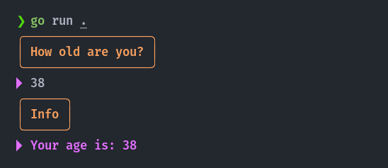

## Cute Print


A cute Go print package *(fmt alternative)*, Minimalist, No dependencies!

Support me to be an independent open-source programmer 💟

[](https://ko-fi.com/U7U3FQ2JA)

## Installation
```sh
go get github.com/zakaria-chahboun/cute
```
The idea is to simplify the printing of messages in the terminal, *especially in error case*. Letting you to put a title for your message in different colors.

## Print line
```go
cute.Println("Hi everyone", "My name is", "Zakaria!")
```


> As you see the default color for the title is `bright yellow` and for the message is `bright purple`.

## Print muti-lines
```go
cute.Printlns("Hi everyone", "My name is Zakaria!", "Zaki is my nick name.")
```


## Check errors
The `cute.Check(..)` is useful in case of errors, especially if you have a lot of functions in you code. It will help you to print a clear error code.

```go
// equal to (if error != nil)
cute.Check("Error Title", errors.New("This is a cute panic!"))
```


## Change colors
You can change the color:
* `ResetColor`
* `DefaultColor`


* `Black` / `BrightBlack`
* `Red` / `BrightRed`
* `Yellow` / `BrightYellow`
* `Green` / `BrightGreen`
* `Blue` / `BrightBlue`
* `Purple` / `BrightPurple`
* `Cyan` / `BrightCyan`
* `White` / `BrightWhite`

```go
cute.SetTitleColor(cute.BrightBlue)
cute.SetMessageColor(cute.BrightGreen)
cute.Println("Hi everyone", "My name is Zakaria!")
```


## Printf
```go
cute.Printf("Another title", "%s, a Country in North Africa.\n", "Morocco")
```


## List
You can print a list of lines dynamically! You can also specify the color for each line:

```go
// juice recipe 🧃
list := cute.NewList(cute.BrightBlue, "Yummy Juice!")
list.Add(cute.BrightGreen, "1 avocado 🥑")
list.Add(cute.BrightRed, "4 strawberry 🍓")
list.Addf(cute.White, "%d ML %s", 500, "milk 🥛")
list.Print()
```


## How you can use it with Scan?
This is a little example:

```go
cute.Printf("How old are you?", "")

var age int
_, err := fmt.Scanln(&age)
cute.Check("Error scan", err)

cute.Println("Info", "Your age is:", age)
```


## Unicode in title box
We supported also a lot of languages and emojis!

```go
// arabic
Println("﴾ الله خالِقُ كُلِّ شيء ﴿")
// frensh
Println("délicieux pain français")
// spanish
Println("¡Hola! español")
// german
Println("ich möchte Kaffee")
// chinese (simplified)
Println("中国的长城")
// chinese (traditional)
Println("中國的長城")
// japanese (hiragana)
Println("進撃の巨人 すばらしい")
// russian
Println("русская литература")
// turkish
Println("türk şarküteri")
// korean
Println("한국라면 맛있다")
// hindi (devanagari)
Println("मसालों की भूमि")
// emoji
Println("✅  🚀")
// complex
Println("sweet | sucré | süß | 甜的 | 甘い | मीठा | حلو | 🍬")
```


## Real example
[Tarjem](https://github.com/zakaria-chahboun/tarjem) is used our cute package, Here are some examples:


## Contribute 💟
Feel free to contribute or propose a feature or share your idea with us!

-------
If you are using `cute` in your project please share that with us 😍👇
Twitter: [@Zaki_Chahboun](https://twitter.com/zaki_chahboun)
	