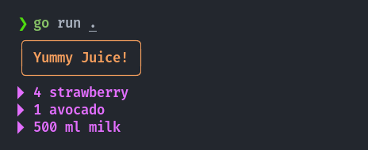
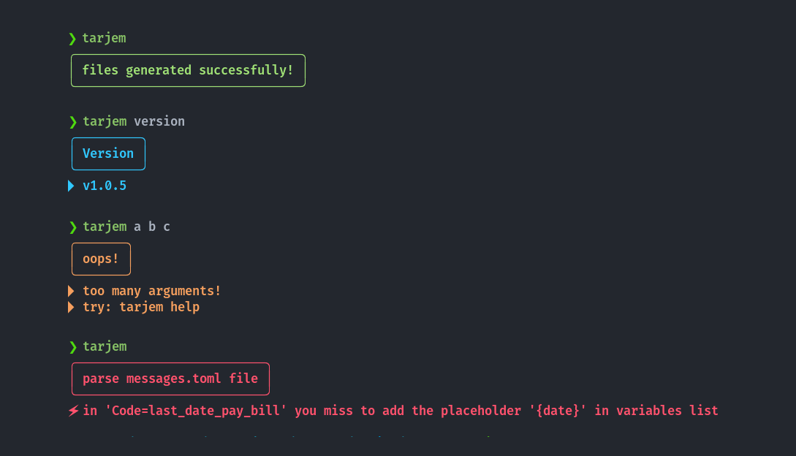

## Cute Print


A cute Go print package *(fmt alternative)*, Minimalist, No dependencies!

Support me to be an independent open-source programmer 💟

[](https://ko-fi.com/U7U3FQ2JA)

## Installation
```sh
go get -u github.com/zakaria-chahboun/cute@latest
```
The idea is to simplify the printing of messages in the terminal, *especially in error case*. Letting you to put a title for your message in different colors.

## Print line
```go
cute.Println("Hi everyone", "My name is", "Zakaria!")
```


> As you see the default color for the title is `bright yellow` and for the message is `bright purple`.

## Note
If the results does not appear well. We suggest you to use fonts like `MesloLGS NF` or `Fira Code` in your terminal!

## Print muti-lines
```go
cute.Printlns("Hi everyone", "My name is Zakaria!", "Zaki is my nick name.")
```


## Check errors
The `cute.Check(..)` is useful in case of errors, especially if you have a lot of functions in you code. It will help you to print a clear error code.

```go
// equal to (if error != nil)
cute.Check("Error Title", errors.New("This is a cute panic!"))
```


## Change colors
You can change the color:
* `ColorReset`
* `ColorDefault`


* `ColorBlack` / `ColorBrightBlack`
* `ColorRed` / `ColorBrightRed`
* `ColorYellow` / `ColorBrightYellow`
* `ColorGreen` / `ColorBrightGreen`
* `ColorBlue` / `ColorBrightBlue`
* `ColorPurple` / `ColorBrightPurple`
* `ColorCyan` / `ColorBrightCyan`
* `ColorWhite` / `ColorBrightWhite`

```go
cute.SetTitleColor(cute.ColorBrightBlue)
cute.SetMessageColor(cute.ColorBrightGreen)
cute.Println("Hi everyone", "My name is Zakaria!")
```


## Printf
```go
cute.Printf("Another title", "%s, a Country in North Africa.\n", "Morocco")
```


## List
You can print a list of lines dynamically! You can also specify the color for each line:

```go
// juice recipe 🧃
list := cute.NewList(cute.ColorBrightBlue, "Yummy Juice!")
list.Add(cute.ColorBrightRed, "4 strawberry")
list.Add(cute.ColorBrightGreen, "1 avocado")
list.Addf(cute.ColorWhite, "%d ml %s", 500, "milk")
list.Print()
```



## Real example
[Tarjem](https://github.com/zakaria-chahboun/tarjem) is used our cute package, Here are some examples:



## Contribute 💟
Feel free to contribute or propose a feature or share your idea with us!

-------
Twitter: [@Zaki_Chahboun](https://twitter.com/zaki_chahboun)
	